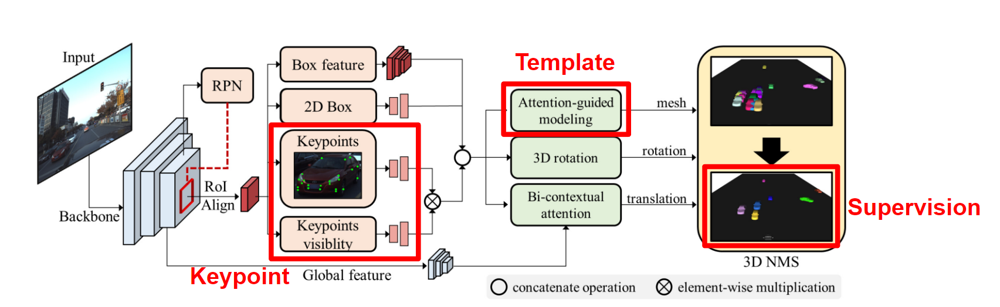

# Vehicular 3D Shape Reconstruction

This repository contain the code for 3D Shape Reconstruction from monocular images taken from a vehicular camera.

## Introduction

Vehicular shape reconstruction and pose estimation is a vital step for autonomous driving tasks. While many SOTA works are based on bounding box detection, shape reconstruction has gained interests in recent past for tasks such as digital twin. However, the lack of extensive labeled dataset with a wide range of classes has made shape reconstruction challenging task. While recent models have used the limited dataset for supervised training, this project focuses on moving towards a semi-supervised / self-supervised learning methodology, which would pave the way for unsupervised techniques.

## Dataset

### Apollo3D

[Apollo3D](https://apolloscape.auto) dataset is an autonomous driving dataset.

- The [car instance set](https://github.com/ApolloScapeAuto/dataset-api/tree/master/car_instance) for shape reconstruction contains more information about the dataset, including the API and links to download the dataset.
- The [Kaggle challenge](https://www.kaggle.com/competitions/pku-autonomous-driving/data?select=car_models_json) for shape reconstruction contains models in `.json` format.

This project uses the [BAAM model](https://github.com/gywns6287/BAAM/tree/main) as the baseline which gives the SOTA performance on 3D vehicular reconstruction and pose estimation. As such the "apollo3D - car instance dataset" should be organized as follows.


```
${CODE Root}
└── data
    └── apollo
        └── train
            └── apollo_annot
            └── images
        └── test
            └── apollo_annot
            └── images
```

The `images` folder contains all the images and the `apollo_annot` folder has all the annotation combined into a single json. More information can be found [here](https://github.com/gywns6287/BAAM/blob/main/for_git/directory.md).

To download the data directly into this format run the following command
```
./BAAM/tools/download_data.sh $APOLLO_PATH
```
This would organize the data into `$APOLLO_PATH/BAAM` folder.

<!-- Note : All the sets listed above contains the same information. However, the organization of data and the file types used differ.  -->

## Baseline Model

The model is built with [BAAM](https://github.com/gywns6287/BAAM/tree/main/) as the baseline.
- The quick run guide can be found in the BAAM repository.
- Alternatively, the docker file provided [here](./BAAM/Dockerfile) can be used to build the image and run it.

### Quickstart

1. Clone the repository and download the pretrained weights as follows.

```
git clone --recurse-submodules https://gitlab.vision.in.tum.de/s0056/vehicular-3d-shape-reconstruction.git
```
2. Download the pre-trained model weights from [here](https://syncandshare.lrz.de/getlink/fiYSLsaGjzJsoTZZacURiq/weights)or by running the command below (optional step)
```
cd vehicular-3d-shape-reconstruction/BAAM && ./BAAM/tools/download_weights.sh
```
3. Setup the environment and install the required packages or build the docker image as follows
```
docker build -t baam .
```
4. Run the docker container making sure that you set the correct `$APOLLO_PATH` to the dataset and `$WEIGHT_PATH` to the pre-trained models.
```
docker run --gpus all --rm -it \
-p 8888:8888 \
-e DISPLAY=$DISPLAY -v /tmp/.X11-unix/:/tmp/.X11-unix/ \
-v $APOLLO_PATH:/mnt/dataset \
-v $WEIGHT_PATH:/mnt/weights \
baam bash
```
5. Once the container is running, activate the environment
```
source activate baam
```


### Training

The training scripts are based on BAAM implementation. The pretrained backbone (bbox and keypoint extractor) is based on [COCO 2017 weights](https://drive.google.com/file/d/1GZyzJLB3FTcs8C7MpZRQWw44liYPyOMD/edit). You can downlod pre-trained 2D module weights (res2net_bifpn.pth) from [here](https://syncandshare.lrz.de/getlink/fiB86FKp5aSFcm6ZN6bHYH/res2net_bifpn.pth) or [here](https://drive.google.com/file/d/1aX_-SfHtXAdE-frgrbrlQYuWddhwX3V3/view?usp=drive_link).

Run the command below for training
```
python main.py --train --config $TRAIN_CONFIG
```
`$TRAIN_CONFIG` is the configuration used for training with the pretrained res2net_bifpn backbone. The configuration files for the experiments conducted can be found in the [configs](./BAAM/BAAM/configs/) folder.

Alternatively, run the code snippet `train_model(cfg, model)` code snippet in the [main.ipynb](./BAAM/BAAM/main.ipynb)

### Inference
Train the model, or download [pre-trained weights](https://drive.google.com/file/d/1oM-iA5Z-8AOBgX5hUCfAoLX8hcn4YBpp/view?usp=sharing) to the root directory. Then run the command below.
```
python main.py --config $TEST_CONFIG
```

Alternatively, run the code snippet `test_model(cfg, model)` code snippet in the [main.ipynb](./BAAM/BAAM/main.ipynb)

### Evaluation

First obtain the result through training or evaluation. This should be saved in `$OUTPUT/res` directory. Then run the command below.
```
python evaluation/eval.py --light --gt_dir data/apollo/BAAM/test/apollo_annot  --test_dir outputs/res --res_file outputs/test_results.txt
```
By default the A3DP results are written to `test_results.txt`.


### Prediction

The figure below shows a sample input and the prediction with the BAAM model.

Image             |  Prediction
:-------------------------:|:-------------------------:
  |  


## Experiments

The baseline model used has the following shortcomings:
- Dependance on keypoint labels
- Dependance on template shapes
- 3D shape labels required for supervised training



The following objectives were set to overcome these limitations:
- Remove dependency on keypoint labels and template shapes.
- Update model to achieve similar performance without additional features.
- Move towards semi-supervised / unsupervised learning techniques for training.

A detailed report can be found [here](./reports/final_report.pdf) on how these objectives were achieved through multiple experiments.


## Documentation

- The weekly progress report can be found [here](https://docs.google.com/document/d/16RfMfSbtCRv5nYbSyYtppTITUEyDj1bzGLlCNlxb1fs/edit?usp=sharing)
- The final presentation can be found [here](https://docs.google.com/presentation/d/1VxpvzizF0vpctm1kqmw6QjIc0_3czwvEI6BdjF1ogXg/edit?usp=sharing)
- The final report can be found [here](./reports/final_report.pdf)


<!-- ## Getting started

To make it easy for you to get started with GitLab, here's a list of recommended next steps.

Already a pro? Just edit this README.md and make it your own. Want to make it easy? [Use the template at the bottom](#editing-this-readme)!

## Add your files

- [ ] [Create](https://docs.gitlab.com/ee/user/project/repository/web_editor.html#create-a-file) or [upload](https://docs.gitlab.com/ee/user/project/repository/web_editor.html#upload-a-file) files
- [ ] [Add files using the command line](https://docs.gitlab.com/ee/gitlab-basics/add-file.html#add-a-file-using-the-command-line) or push an existing Git repository with the following command:

```
cd existing_repo
git remote add origin https://gitlab.vision.in.tum.de/s0056/vehicular-3d-shape-reconstruction.git
git branch -M main
git push -uf origin main
```

## Integrate with your tools

- [ ] [Set up project integrations](https://gitlab.vision.in.tum.de/s0056/vehicular-3d-shape-reconstruction/-/settings/integrations)

## Collaborate with your team

- [ ] [Invite team members and collaborators](https://docs.gitlab.com/ee/user/project/members/)
- [ ] [Create a new merge request](https://docs.gitlab.com/ee/user/project/merge_requests/creating_merge_requests.html)
- [ ] [Automatically close issues from merge requests](https://docs.gitlab.com/ee/user/project/issues/managing_issues.html#closing-issues-automatically)
- [ ] [Enable merge request approvals](https://docs.gitlab.com/ee/user/project/merge_requests/approvals/)
- [ ] [Automatically merge when pipeline succeeds](https://docs.gitlab.com/ee/user/project/merge_requests/merge_when_pipeline_succeeds.html)

## Test and Deploy

Use the built-in continuous integration in GitLab.

- [ ] [Get started with GitLab CI/CD](https://docs.gitlab.com/ee/ci/quick_start/index.html)
- [ ] [Analyze your code for known vulnerabilities with Static Application Security Testing(SAST)](https://docs.gitlab.com/ee/user/application_security/sast/)
- [ ] [Deploy to Kubernetes, Amazon EC2, or Amazon ECS using Auto Deploy](https://docs.gitlab.com/ee/topics/autodevops/requirements.html)
- [ ] [Use pull-based deployments for improved Kubernetes management](https://docs.gitlab.com/ee/user/clusters/agent/)
- [ ] [Set up protected environments](https://docs.gitlab.com/ee/ci/environments/protected_environments.html)

***

# Editing this README

When you're ready to make this README your own, just edit this file and use the handy template below (or feel free to structure it however you want - this is just a starting point!). Thank you to [makeareadme.com](https://www.makeareadme.com/) for this template.

## Suggestions for a good README
Every project is different, so consider which of these sections apply to yours. The sections used in the template are suggestions for most open source projects. Also keep in mind that while a README can be too long and detailed, too long is better than too short. If you think your README is too long, consider utilizing another form of documentation rather than cutting out information.

## Name
Choose a self-explaining name for your project.

## Description
Let people know what your project can do specifically. Provide context and add a link to any reference visitors might be unfamiliar with. A list of Features or a Background subsection can also be added here. If there are alternatives to your project, this is a good place to list differentiating factors.

## Badges
On some READMEs, you may see small images that convey metadata, such as whether or not all the tests are passing for the project. You can use Shields to add some to your README. Many services also have instructions for adding a badge.

## Visuals
Depending on what you are making, it can be a good idea to include screenshots or even a video (you'll frequently see GIFs rather than actual videos). Tools like ttygif can help, but check out Asciinema for a more sophisticated method.

## Installation
Within a particular ecosystem, there may be a common way of installing things, such as using Yarn, NuGet, or Homebrew. However, consider the possibility that whoever is reading your README is a novice and would like more guidance. Listing specific steps helps remove ambiguity and gets people to using your project as quickly as possible. If it only runs in a specific context like a particular programming language version or operating system or has dependencies that have to be installed manually, also add a Requirements subsection.

## Usage
Use examples liberally, and show the expected output if you can. It's helpful to have inline the smallest example of usage that you can demonstrate, while providing links to more sophisticated examples if they are too long to reasonably include in the README.

## Support
Tell people where they can go to for help. It can be any combination of an issue tracker, a chat room, an email address, etc.

## Roadmap
If you have ideas for releases in the future, it is a good idea to list them in the README.

## Contributing
State if you are open to contributions and what your requirements are for accepting them.

For people who want to make changes to your project, it's helpful to have some documentation on how to get started. Perhaps there is a script that they should run or some environment variables that they need to set. Make these steps explicit. These instructions could also be useful to your future self.

You can also document commands to lint the code or run tests. These steps help to ensure high code quality and reduce the likelihood that the changes inadvertently break something. Having instructions for running tests is especially helpful if it requires external setup, such as starting a Selenium server for testing in a browser.

## Authors and acknowledgment
Show your appreciation to those who have contributed to the project.

## License
For open source projects, say how it is licensed.

## Project status
If you have run out of energy or time for your project, put a note at the top of the README saying that development has slowed down or stopped completely. Someone may choose to fork your project or volunteer to step in as a maintainer or owner, allowing your project to keep going. You can also make an explicit request for maintainers. 
-->
